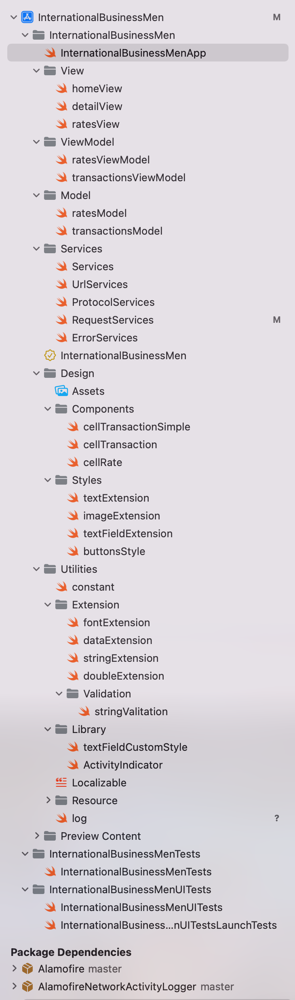

# International Business Men.
You work for GNB (Goliath National Bank), and your manager, Barney Stinson, has asked you to design and implement a mobile application to help the firm executives who are always flying around the globe. Your executives need a list of every product GNB trades with, and the total sum of sales of those products in different currencies.

## DEVELOPED COMPLETED


To see the best resolution click here:
https://github.com/claumartines/InternationalBusinessMen/blob/main/README_MOVIE.mp4

## ARCHITECTURE

  

# REQUIREMENTS

## API
https://android-ios-service.herokuapp.com/rates will return you a document with the following formats:

 ```json
[{ "from": "EUR", "to": "USD", "rate": "1.359" }, 
{ "from": "CAD", "to": "EUR", "rate": "0.732" }, 
{ "from": "USD", "to": "EUR", "rate": "0.736" }, 
{ "from": "EUR", "to": "CAD", "rate": "1.366" }]
  ```

https://android-ios-service.herokuapp.com/transactions will return you a document with the following formats:
 ```json
[{ "sku": "T2006", "amount": "10.00", "currency": "USD" },
{ "sku": "M2007", "amount": "34.57", "currency": "CAD" }, 
{ "sku": "R2008", "amount": "17.95", "currency": "USD" }, 
{ "sku": "T2006", "amount": "7.63", "currency": "EUR" },
{ "sku": "B2009", "amount": "21.23", "currency": "USD" }]
  ```
## IMPORTANT

Each dictionary from the array specifies the conversion rate from one currency to another (when the direct conversion is given, the reverse one is also provided), but some conversions may not be specified, and in case they are needed, they will have to be calculated using the already known conversions. For example, in the sample data we don’t provide the USD to CAD conversion, that should be calculated from the USD to EUR and the EUR to CAD conversions.

Each dictionary represents a transaction of a given product (indicated by the product SKU) in given currency for the given amount.
Your application should download this information upon starting and give the user the choice of which product they want to see. When the user selects a product, the application must show each of the transactions related to that product and a sum of all the transactions transformed into EUR.
For example, for the sample data, the total sum for the product T2006 should be 14,99 EUR.

## Requirements
- Do not block the UI while downloading the data from the network. Do not download the data from the network before showing the UI.
- The use of design patterns, DI, well structured code and project architecture will be valued (do it as you would with a project with a larger scope).
 - Remember that some conversion rates are missing, and they should be derived using the information provided.
 - You must use Swift and any third party libraries, as you would do with any project.
 - iOS min version should be 14.0

